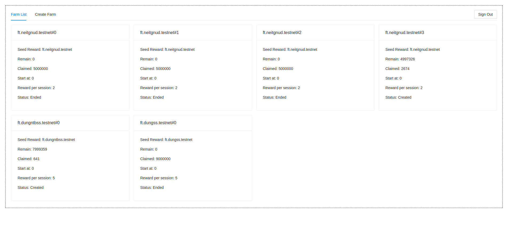

# near farming

# Intro

NEAR farming is an farming contract using NEP-141 standard for fungible tokens.

# How to install

- Deploy multiple ft contracts adn one farming contract save it addresses and change into ```setup.md``` and ```client/src/config.js``` file.

- ```cd ui && npm i && npm run start``` and run some commands in ```setup.md``` to test application. This app is just test and not completed.

# UI


